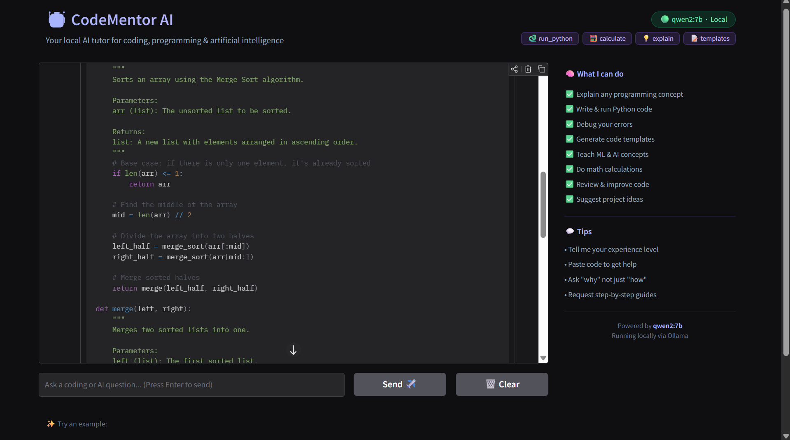

# 🤖 CodeMentor AI

> A locally-running AI agent powered by **qwen2:7b** via Ollama — your personal tutor for coding, programming, and AI. No API keys. No cloud. Runs entirely on your machine.


---

<div align="center">
  
  <p><i>CodeMentor AI generating a fully documented Merge Sort implementation in Python</i></p>
</div>

---

## ✨ What Makes This Project Interesting

Most AI assistants send your data to a remote cloud server and require paid API keys. This project takes a different approach — it runs a full ReAct (Reasoning + Acting) agent loop entirely on your local machine using Ollama. The agent can reason about your question, decide whether it needs to use a tool, execute that tool, observe the result, and then form a final answer grounded in real output. All of this happens on your own hardware, with zero data leaving your computer.

---

## 🛠️ Features

- 🧠 **ReAct Agent Loop** — the agent reasons about whether to answer directly or use a tool before responding
- 🐍 **Live Python Execution** — runs code snippets in a sandboxed environment and shows the real output
- 🧮 **Math Calculator** — evaluates expressions using a safe, restricted evaluator
- 💡 **Concept Explainer** — structures explanations at beginner, intermediate, or advanced level
- 📝 **Code Template Generator** — produces clean starter templates for common programming patterns
- 💬 **Streaming Responses** — responses appear token by token, just like ChatGPT
- 🔒 **100% Local** — no API keys, no internet required after setup, no data sent anywhere
- 🎨 **Dark UI** — clean Gradio interface with syntax-highlighted code blocks

---

## 📁 Project Structure

```
SimpleAIAgent/
├── agent/                  # The brain — ReAct loop, Ollama API, tools
│   ├── __init__.py
│   ├── agent.py            # Core agent: message handling, tool detection, streaming
│   ├── tools.py            # Tool definitions and executors (run_python, calculate, etc.)
│   └── prompts.py          # System prompt — gives the model its CodeMentor personality
│
├── ui/                     # The face — Gradio chat interface
│   ├── __init__.py
│   └── app.py              # Chat UI with streaming, example prompts, sidebar
│
├── utils/                  # Shared helpers
│   ├── __init__.py
│   └── helpers.py          # Logger, Ollama health checks, startup banner
│
├── tests/                  # Automated test suite
│   ├── __init__.py
│   └── test_agent.py       # pytest tests for tools and agent logic
│
├── assets/
│   └── screenshot.png      # UI screenshot used in this README
│
├── .github/
│   └── workflows/
│       └── ci.yml          # GitHub Actions — runs tests on every push
│
├── .vscode/
│   ├── settings.json       # VS Code project settings (auto-format, interpreter path)
│   └── extensions.json     # Recommended VS Code extensions
│
├── .env.example            # Environment variable template (copy to .env to use)
├── .gitignore              # Tells Git what NOT to commit (venv, secrets, cache)
├── requirements.txt        # All Python dependencies — install with pip
├── main.py                 # Entry point — run this to start the agent
└── README.md               # You are here
```

---

## 🚀 Quick Start

### Prerequisites

Make sure you have these installed before starting:

| Tool | Version | Why You Need It | Download |
|------|---------|----------------|----------|
| Python | 3.11+ | Runs all the code | [python.org](https://python.org) |
| Git | Any | Version control | [git-scm.com](https://git-scm.com) |
| Ollama | Latest | Runs the AI model locally | [ollama.com](https://ollama.com) |
| VS Code | Latest | Recommended editor | [code.visualstudio.com](https://code.visualstudio.com) |

---

### Step 1 — Clone the Repository

```bash
git clone https://github.com/YOUR_USERNAME/simple-ai-agent.git
cd simple-ai-agent
```

---

### Step 2 — Create and Activate a Virtual Environment

A virtual environment keeps this project's packages isolated from everything else on your system. Think of it as a clean room specifically for this project.

**Windows:**
```bash
python -m venv venv
venv\Scripts\activate
```

**macOS / Linux:**
```bash
python -m venv venv
source venv/bin/activate
```

You will see `(venv)` appear at the start of your terminal prompt — this confirms the environment is active.

---

### Step 3 — Install Dependencies

```bash
pip install -r requirements.txt
```

---

### Step 4 — Set Up Ollama and Pull the Model

```bash
# Start the Ollama server (keep this running in the background)
ollama serve

# In a new terminal window, download the model (~4 GB, one-time only)
ollama pull qwen2:7b
```

---

### Step 5 — Run the Agent

```bash
python main.py
```

Your browser will open automatically at **http://localhost:7860** 🎉

---

## 🛠️ Available Tools

The agent uses a ReAct loop — it reads your message, decides if it needs a tool, runs the tool, and uses the result to form its answer. Here are the five tools it has access to:

| Tool | Description | Example Trigger |
|------|-------------|----------------|
| `run_python` | Executes Python code in a sandboxed environment | "Run this code for me" |
| `calculate` | Evaluates math expressions safely | "What is sqrt(144) * pi?" |
| `get_datetime` | Returns the current date and time | "What is today's date?" |
| `explain_concept` | Structures a concept explanation by level | "Explain recursion to a beginner" |
| `generate_code_template` | Creates clean starter code for a given task | "Give me a Flask API template" |

---

## 💬 Example Conversations

Here are some prompts that showcase what the agent does well:

```
"Explain how neural networks work like I'm 16 years old"
"Write and run a merge sort algorithm in Python"
"What is the difference between supervised and unsupervised learning?"
"Debug this code for me: [paste your code]"
"What is RAG and why do AI engineers use it?"
"Build me a simple REST API with Flask, step by step"
```

---

## 🧪 Running the Tests

```bash
# Run all tests with detailed output
pytest tests/ -v

# Run tests with a coverage report showing which lines are tested
pytest tests/ --cov=agent --cov=utils --cov-report=term-missing
```

---

## ⚙️ Configuration

Copy the example environment file and edit it to customise the agent's behaviour:

```bash
cp .env.example .env
```

The available settings are:

```env
OLLAMA_URL=http://localhost:11434    # where Ollama is running
MODEL_NAME=qwen2:7b                  # which model to use
UI_PORT=7860                         # which port to serve the UI on
```

---

## 🔄 Switching to a Different Model

Because this project uses Ollama, swapping the AI model is as simple as pulling a new one and updating one line of configuration. Some good alternatives to try:

```bash
ollama pull llama3:8b      # Meta's Llama 3 — great all-rounder
ollama pull mistral:7b     # Mistral — fast and capable
ollama pull codellama:7b   # Code Llama — specialised for programming tasks
```

Then update `MODEL_NAME` in `agent/agent.py` or your `.env` file to match.

---

## ⚠️ Security Note

The `run_python` tool executes code locally on **your own machine** only. This project is designed for local, personal use. Do not deploy it as a public web service without implementing proper sandboxing (such as Docker with restricted permissions), as the code execution tool would become a security risk if exposed to untrusted users on the internet.

---

## 🗺️ Ideas for Extending This Project

Once you are comfortable with the codebase, here are natural next steps to make it more powerful:

**Web Search Tool** — integrate DuckDuckGo's free API (no key required) so the agent can look up current information rather than relying only on its training data.

**Persistent Memory** — save conversation history to a SQLite database so the agent remembers previous sessions across restarts.

**Voice Input** — integrate OpenAI's Whisper model (also runs locally via Ollama) for speech-to-text so you can speak your questions.

**Multi-Agent** — build a second specialised agent (e.g. a "Code Reviewer" agent) and have the main agent delegate tasks to it.

---

## 📤 How to Push Your Own Changes to GitHub

```bash
git add .
git commit -m "feat: describe what you changed"
git push origin main
```

---

## 📄 License

MIT — free to use, modify, and share for any purpose.

---

## 🙏 Built With

[Ollama](https://ollama.com) for running the LLM locally, [qwen2:7b](https://ollama.com/library/qwen2) as the language model, [Gradio](https://gradio.app) for the chat interface, and [pytest](https://pytest.org) for testing.

---

*Built for learners who want to understand AI from the inside out.*